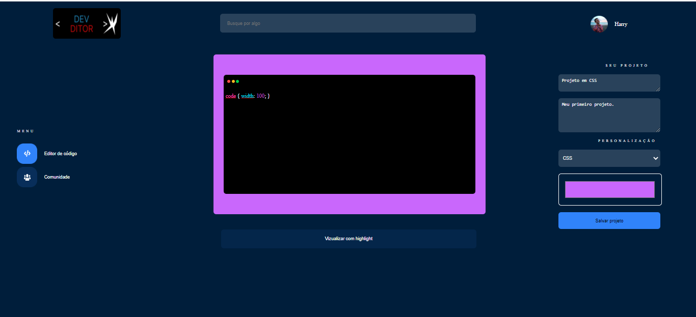
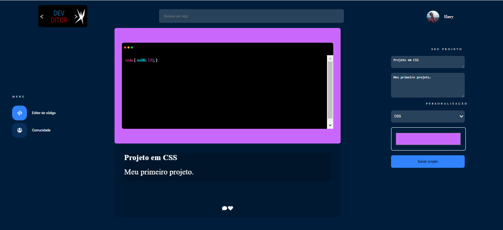
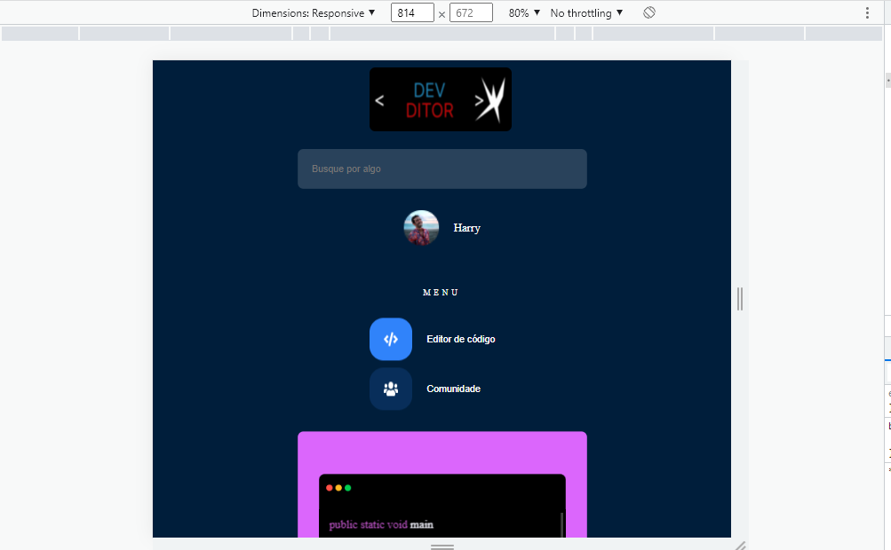
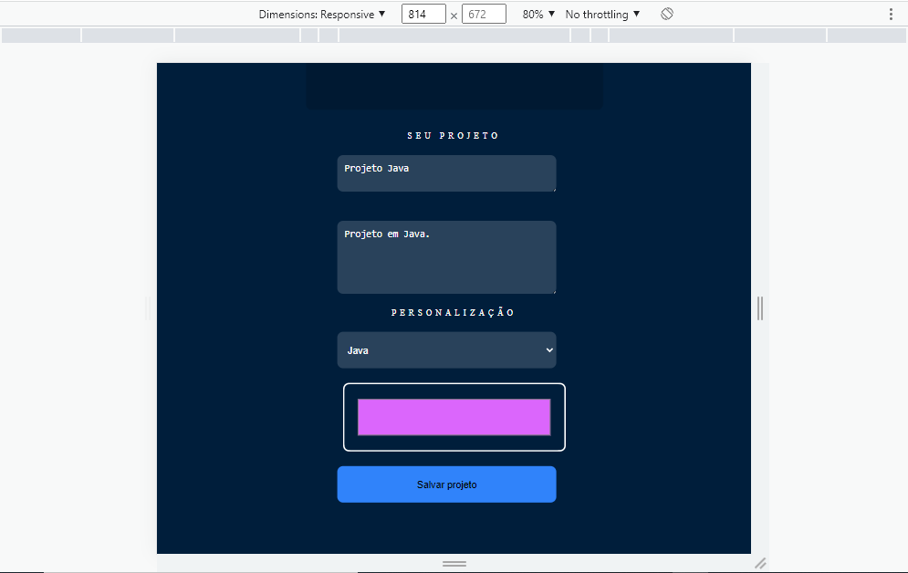

# DESAFIO 1 
# DO FIGMA AO HTML E CSS

Desenvolver a partir da história: existe um produtor de conteúdo de progamacao e tecnologia e ele sempre teve vontade de compartilhar trechos de código que ele produz (em qualquer que seja a linguagem). Crie e desenvolva uma plataforma em que ele possa editar e criar códigos e deixe ele bem bonito para postar. A pessoa pode usar no celular, no notebook. Caso precise de novas utilidades, essa utilidade deve ser fácil de colocar 

Estrutura do projeto: HTML5 
Parte visual: CSS3 
Funcionalidades: Javascript 
Design do projeto: Figma 
Framework: Highlight JS (sintaxe highlight do projeto) 
Tarefas: trello

Montar a estrutura do editor de texto 
Cabeçalho: vai ter o logo da página, vai ter a barra de busca , uma parte com o ícone da pessoa que vai desenvolver (como se fosse uma área de logado) e o nome dessa pessoa. A esquerda, será o menu de navegação, aqui temos o editor de código e um link para página de comunidades (essa página só vai ser desenvolvida mais tarde. Ter um campo onde a pessoa pode escrever algum código. Abaixo da estrutura de texto há um botão de visualizar com highlight para colocar sintaxe highlight. A direita do projeto tera outra barra onde você vai colocar informações do projeto (nome do projeto, descrição) e você vai selecionar qual linguagem você quer aplicar ao sintaxe inlight. A sintaxe pode mudar de acordo com a linguagem.  Logo abaixo , uma customização aqui para trocar a cor de fundo do editor de texto, ou trocar a moldura em volta do editor de texto. Em baixo tem o botão de adicionar projeto.

O que deve funcionar a primeiro momento? 
-O texto digitado deve ser visualizado na página 
-ao digitar o nome do projeto, ele deve ter a possibilidade de ser reescrito

# DESAFIO 2
# Adicionando sintaxe Highlight com Javascript

dizer para o highlight qual a linguagem que ele está usando 
Trocar a cor de fundo 

Com o highlight js: ao selecionar a linguagem, o código ficará com uma cor diferente 
Ela depende da linguagem que vc utilizar 
Podemos mudar totalmente a estilização do código 

Página de comunidade 
Apresentar todos os nossos projetos feitos no editor de texto 
Ao clicar em salvar projeto, o código será salvo e deve aparecer na parte de comunidade 
Ele terá o título do projeto e a descrição do projeto

Gerar o cadastramento 

Ao clicar no código, ele deve voltar para o editor para que 

Devemos implementar os botões de like e comentário também

## pagina principal 

## pagina comunidade

## responsivo 
## 1

## 2

## 3

